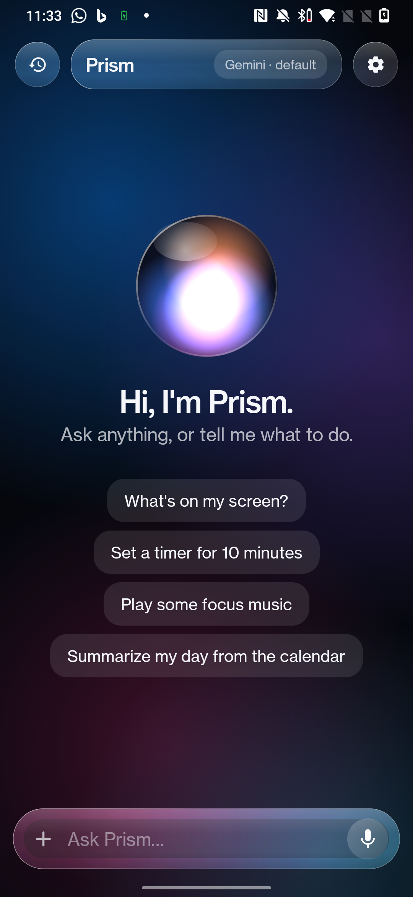
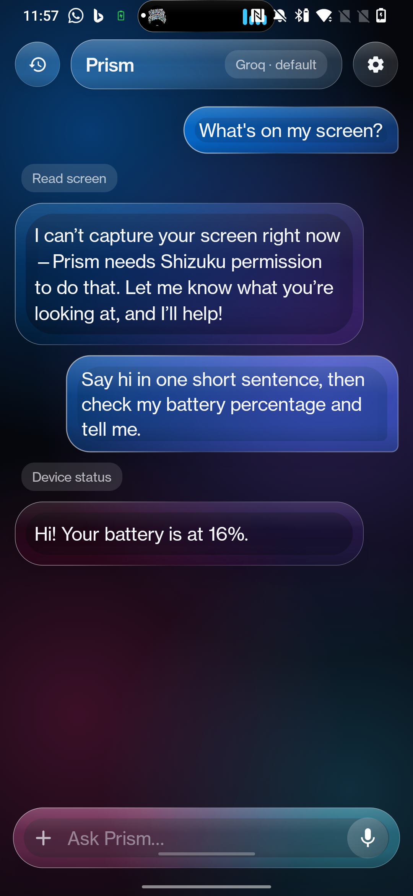
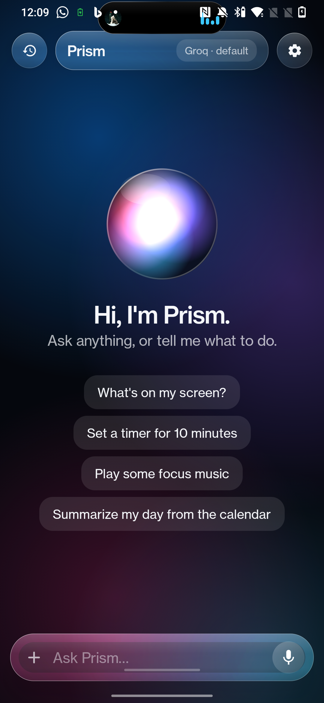
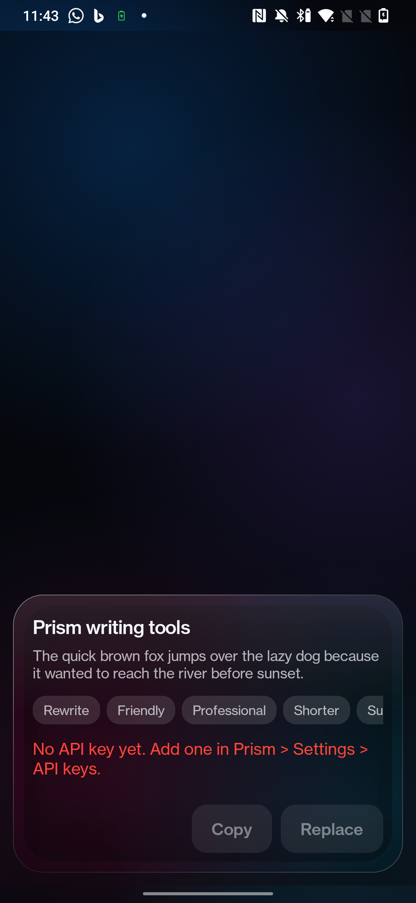
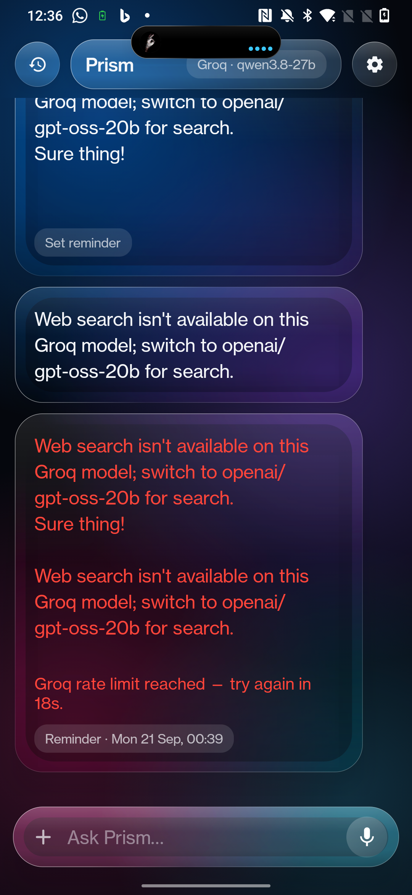

# Prism

A Liquid-Glass / Siri-style assistant and control center for Android 12 (built for a OnePlus 7). Kotlin + Jetpack Compose, no root.

- Chat with **Gemini** or **Groq** using your own key (stored in the Android Keystore, never shown again)
- Voice in/out, conversation mode, phone actions via tools (apps, alarms, reminders, calendar, music, toggles)
- **Screen / photo / document understanding**, text-selection writing tools, share target
- **Dynamic Island** around the notch (music, calls, timers, charging, low battery, Wi-Fi/Bluetooth)
- **Control center** over any app, with an OpenGL refraction backdrop
- Editable **memory** and history, all on the phone
- Optional **Shizuku** for the switches Android reserves for the system

Build: `.\gradlew.bat assembleDebug` → `app/build/outputs/apk/debug/app-debug.apk`. After a reboot run `tools\shizuku-start.ps1` with the phone plugged in.

## Screenshots

| Home | Chat with tools | Settings |
|---|---|---|
|  |  |  |

| Island | Writing tools | Reminders |
|---|---|---|
|  |  |  |
