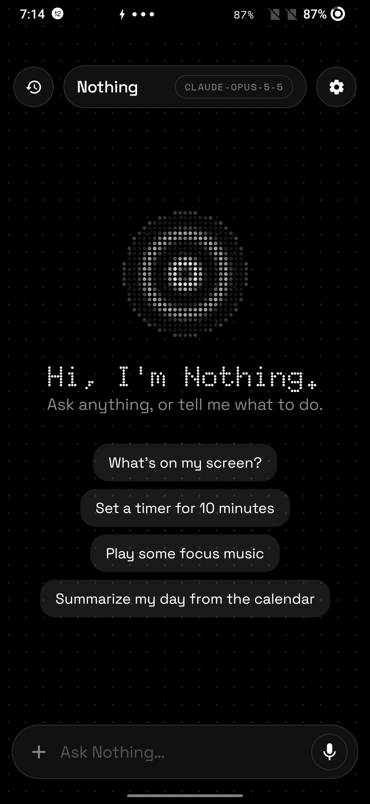
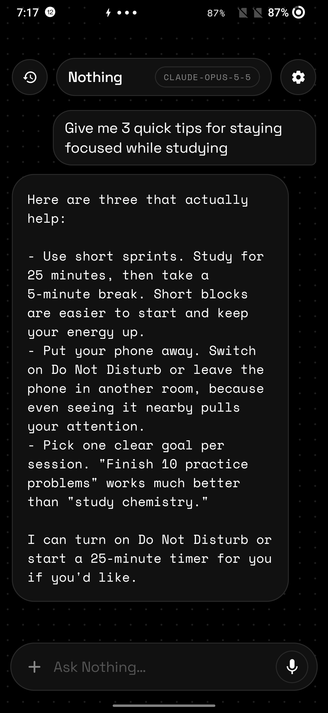
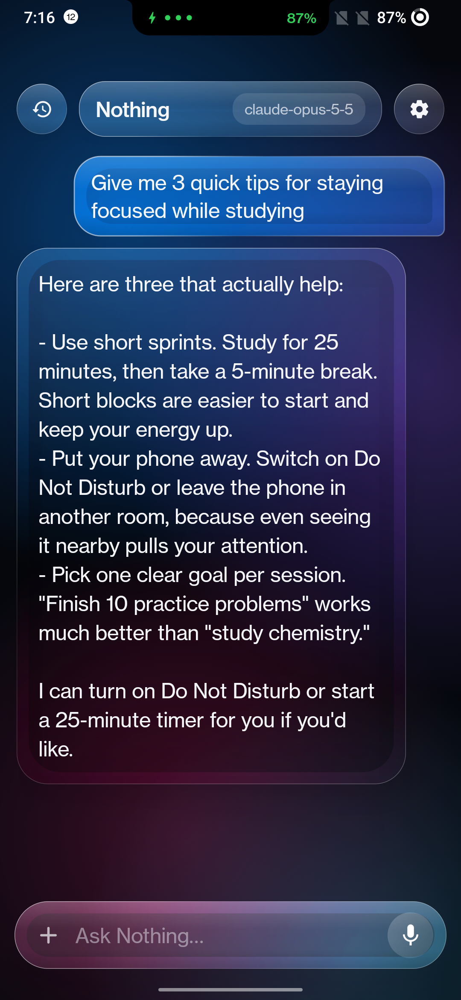
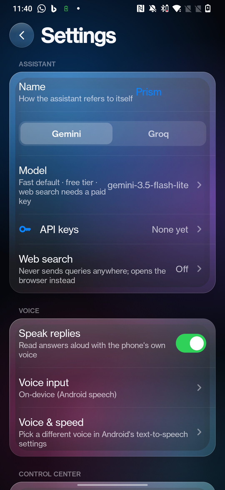
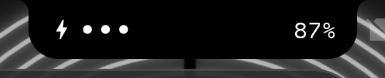

# Prism

A free, Siri-style assistant that gives you control of your phone and a new way to customise it: a Liquid-Glass assistant, control center and Dynamic Island for Android 12, built for a OnePlus 7. Kotlin + Jetpack Compose, no root, bring your own AI key (Gemini, Groq or Claude).

**Releases:** `v1.0` is the first complete build (assistant, control center, island, reminders, writing tools). `v2.0` adds the iOS-27 lens looks, the glass icon and Claude. `v3.0` adds the Nothing look, the always-on display, a free Gemini key setup and the split island.

**New on `main` since v3.0:** the island moved into the notch. It can show several things at once, answers questions right there, and makes widgets for [Morse](https://github.com/meetdheeran/morse), a Nothing-style launcher.

- Chat with **Gemini**, **Groq** or **Claude** using your own key (stored in the Android Keystore, never shown again)
- Voice in/out, conversation mode, phone actions via tools (apps, alarms, reminders, calendar, music, toggles)
- **Screen / photo / document understanding**, text-selection writing tools, share target
- **Dynamic Island in the notch**: with Prism's accessibility switch on, a black tab grows out of the camera cutout, above the status bar, so tapping it never opens the notification shade
  - Music, calls, timers, downloads and charging can be live at once: swipe sideways to switch, pull down to open the app
  - Tap during music for a wide music card
  - Hold to ask a question; the short answer shows right in the island
  - Shows Morse's face check
- **Always-on display** with album art and charging dots
- **Control center** over any app, with an OpenGL refraction backdrop
- Editable **memory** and history, all on the phone
- Optional **Shizuku** for the switches Android reserves for the system

Build: `.\gradlew.bat assembleDebug` → `app/build/outputs/apk/debug/app-debug.apk`. After a reboot run `tools\shizuku-start.ps1` with the phone plugged in.

## Screenshots

Taken on the OnePlus 7 with the current build, everything shown working.

| Home (Nothing look) | Chat with Claude | Same chat, Glass look |
|---|---|---|
|  |  |  |

| Settings: look, signal colour, glyphs | The island in the notch (charging) |
|---|---|
|  |  |
